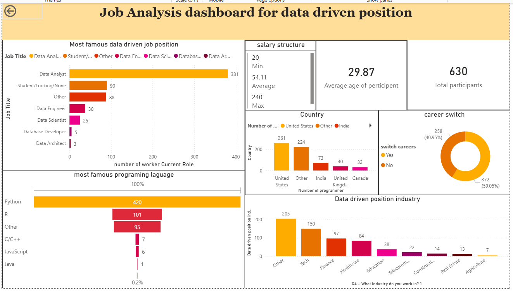
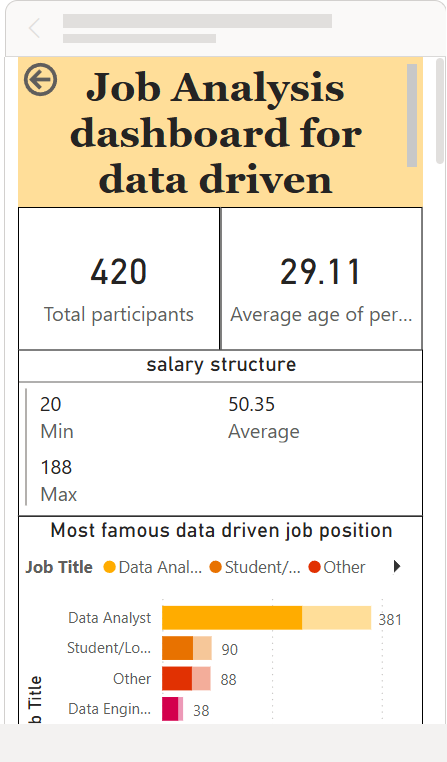

# 📊 Data-Driven Careers: Job Market Analysis

A comprehensive Power BI analytics project that provides deep insights into the job market landscape, helping professionals and organizations make data-driven career decisions.



)

## 🎯 Project Overview

This project leverages Power BI to analyze job market trends, salary distributions, skill demands, and career opportunities across various industries and locations. The interactive dashboard provides actionable insights for job seekers, recruiters, and business analysts.

## ✨ Key Features

- **📈 Interactive Dashboards**: Dynamic visualizations showcasing job market trends
- **💰 Salary Analysis**: Comprehensive salary breakdowns by role, location, skills
- **🔍 Skill Demand Tracking**: Identify the most in-demand skills in the current market as programming languages
- **🌍 Geographic Insights**: Location-based job market analysis

- **🎓 Experience Level Analysis**: Understand job sector for data driven career stages

## 🛠️ Technologies Used

- **Power BI Desktop**: For creating interactive dashboards and visualizations
- **Microsoft Excel**: Data preprocessing and initial analysis
- **DAX (Data Analysis Expressions)**: For calculated columns and measures
- **Power Query**: Data transformation and cleaning

## 📁 Project Structure

```
Data-Driven Careers-Job Market Analysis/
│
├── Power BI - Final Project.xlsx    # Source data file
├── project1.pbit                     # Power BI template file
└── README.md                         # Project documentation
```

## 🚀 Getting Started

### Prerequisites

- Microsoft Power BI Desktop (Latest version recommended)
- Microsoft Excel 2016 or later

### Installation & Setup

1. **Clone the repository**

   ```bash
   git clone https://github.com/yourusername/Data-Driven-Careers-Job-Market-Analysis.git
   cd Data-Driven-Careers-Job-Market-Analysis
   ```

2. **Open the Power BI Template**

   - Launch Power BI Desktop
   - Open `project1.pbit` file
   - The template will prompt you to connect to the data source

3. **Load the Data**
   - Ensure `Power BI - Final Project.xlsx` is in the same directory
   - Refresh the data connections in Power BI
   - Navigate through the dashboard pages

## 📊 Dashboard Components

### 1. **Overview Dashboard**

- Key metrics and KPIs
- Total perticipent in the job market in deffernt roles
- Average salary trends
- Top Jobs role in the job market

### 2. **Salary Analysis**

- Salary distribution by role
- Geographic salary comparison
- programming languages vs. salary analysis

## 📈 Key Insights

>

- 🔹 **Insight 1**: [Python is most used programming language in the job market]
- 🔹 **Insight 2**: [Most demanded postion in the job market is Data anlyst]
- 🔹 **Insight 3**: [Avarage salary of Data anlyst is 54k]
- 🔹 **Insight 4**: [59.02% switch their career to Data Science]

## 🎓 Use Cases

- **Job Seekers**: Identify high-demand skills and competitive salary ranges
- **Recruiters**: Understand market trends to attract top talent
- **Career Counselors**: Guide students and professionals on career paths
- **Business Analysts**: Market research and competitive analysis
- **HR Departments**: Benchmark salaries and plan workforce strategies

## 📸 Screenshots

## 🔄 Data Sources

- **Primary Data**: Job market data from [Alex the Analyst's Power BI Repository](https://github.com/AlexTheAnalyst/Power-BI)
- **Data Format**: Excel format (Power BI - Final Project.xlsx)
- **Data Focus**: Data-driven careers including Data Analyst, Data Scientist, and related roles
- **Key Metrics**: Salary information, programming languages, job roles, and geographic distribution

## 📝 Methodology

1. **Data Transformation**: Used Power Query for ETL processes
2. **Data Modeling**: Created relationships between tables
3. **Visualization**: Designed interactive dashboards with drill-down capabilities
4. **Analysis**: Applied statistical methods to derive insights

## 🤝 Contributing

Contributions are welcome! If you'd like to improve this project:

1. Fork the repository
2. Create a feature branch (`git checkout -b feature/AmazingFeature`)
3. Commit your changes (`git commit -m 'Add some AmazingFeature'`)
4. Push to the branch (`git push origin feature/AmazingFeature`)
5. Open a Pull Request

## 📧 Contact

**Your Name** - [abidsarkar0@gmail.com](mailto:abidsarkar0@gmail.com)

Project Link: [https://github.com/abidsarkar/Data-Driven-Careers-Job-Market-Analysis](https://github.com/abidsarkar/Data-Driven-Careers-Job-Market-Analysis)

LinkedIn: [LinkedIn Profile](https://www.linkedin.com/in/md-abid-sarkar)

## 📄 License

This project is licensed under the MIT License - see the [LICENSE](LICENSE) file for details.

## 🙏 Acknowledgments

- **[Alex the Analyst](https://github.com/AlexTheAnalyst)** - For providing the dataset and inspiring this project through his excellent Power BI tutorials on YouTube
- **Alex the Analyst's YouTube Channel** - For comprehensive Power BI tutorials that guided the development of this dashboard
- Power BI community for best practices and continuous learning resources

## 🔮 Future Enhancements

- [ ] Add real-time data refresh capabilities
- [ ] Integrate machine learning predictions for job trends
- [ ] Expand geographic coverage
- [ ] Add more granular skill categorization
- [ ] Create mobile-optimized dashboard views
- [ ] Implement automated reporting features

---

<div align="center">

**⭐ If you find this project useful, please consider giving it a star! ⭐**

Made with ❤️ and Power BI

</div>
